# Pattern Recognition

**Table of contents**
- [Decoding of a noised number](#lab-1--decoding-of-a-noised-number)
- [Risk minimization](#lab-2--risk-minimization)
- [Risk minimization](#lab-3--risk-minimization)
- [Analysis of Nonbayesian Strategy](#lab-4--analysis-of-nonbayesian-strategy)
- [Efficient computation of a sum of a subarray in 1D](#lab-5--efficient-computation-of-a-sum-of-a-subarray-in-1d-2d-and-3d)
- [Divisibility sum of digits](#lab-6--divisibility-sum-of-digits)
- [Binocular stereo vision](#lab-7--binocular-stereo-vision)
- [Binary Clustering](#lab-8--binary-clustering)
- [Finding the separating circle](#lab-9--finding-the-separating-circle)

**Tasks and mathematical solutions**

- [solutions.pdf](`all-labs.pdf`)
- [tasks.pdf](`tasks.pdf`)

## Lab 1 – Decoding of a noised number

### Description
The program converts a number to a noised (bernoulli noise) image and then decodes it.
Bayesian strategy for a binary loss function is used.

### Usage
```commandline
$ python3 decode_number.py --help                       
usage: decode_number.py [-h] --number {0,1,2,3,4,5,6,7,8,9} [--number_height NUMBER_HEIGHT] [--number_width NUMBER_WIDTH] --noise_level NOISE_LEVEL
                           [--seed SEED]

Decode noisy image of a number

options:
  -h, --help            show this help message and exit
  --number {0,1,2,3,4,5,6,7,8,9}
                        Number to encode and decode
  --number_height NUMBER_HEIGHT
                        Height of the number image.
  --number_width NUMBER_WIDTH
                        Width of the number image.
  --noise_level NOISE_LEVEL
                        Probability of Bernoulli noise. (0.0 to 1.0)
  --seed SEED           Random seed for reproducibility
```

### Examples

```bash
$ python3 decode_number.py --number 9 --noise_level 0.56
Time: 0.022138417001769994 sec
Decoded number: 9
```

| Original image                   |                Noised image                | Decoded number |
|----------------------------------|:------------------------------------------:|----------------|
|    | 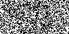 | 9              |


## Lab 2 – Risk minimization

### Description
Bayesian strategy for **interval** loss function is used.

### Usage
```terminaloutput
$ python3 heatmap_interval.py --help
usage: heatmap_interval.py [-h] --n N [--seed SEED]

Minimize the risk of the Bayesian strategy for interval loss function.

options:
  -h, --help   show this help message and exit
  --n N        Number probability values. [0, 250]
  --seed SEED  Random seed for reproducibility
```
### Example

```terminaloutput
$ python3 heatmap_interval.py --n 10
Input heatmap:  [102. 179.  92.  14. 106.  71. 188.  20. 102. 121.]
Heatmap normalized:  [0.10251256 0.1798995  0.09246231 0.01407035 0.10653266 0.07135678
 0.18894473 0.0201005  0.10251256 0.12160804]
Result: 4
```

## Lab 3 – Risk minimization

### Description
Bayesian strategy for **L1** loss function is used.

### Usage
```terminaloutput
$ python3 heatmap_l1.py --help
usage: heatmap_l1.py [-h] --n N [--delta DELTA] [--seed SEED]

Minimize the risk of the Bayesian strategy for L1 loss function.

options:
  -h, --help     show this help message and exit
  --n N          Number probability values. [0, 250]
  --delta DELTA  Delta value for loss function.
  --seed SEED    Random seed for reproducibility
```

### Example

```terminaloutput
$ python3 heatmap_l1.py --n 10 --delta 2
Input heatmap:  [102. 179.  92.  14. 106.  71. 188.  20. 102. 121.]
Heatmap normalized:  [0.10251256 0.1798995  0.09246231 0.01407035 0.10653266 0.07135678
 0.18894473 0.0201005  0.10251256 0.12160804]
Result: 8
```

## Lab 4 – Analysis of Nonbayesian Strategy

### Usage
```terminaloutput
$ python non_bayesian_strategy.py --help                                      
usage: non_bayesian_strategy.py [-h] --values VALUES [VALUES ...] [--seed SEED] [--samples SAMPLES]

Non-Bayesian strategy analysis.

options:
  -h, --help            show this help message and exit
  --values VALUES [VALUES ...]
  --seed SEED
  --samples SAMPLES
```
### Example

```terminaloutput
$ python non_bayesian_strategy.py --values 0 1 2 3 4 --seed 123 --samples 5000
q_quadratic: 2.0
q_binary: 2.0
q_third: 2.0
R_binary: 0.7247191011235955
R_quadratic: 1.9803370786516852
Mean quadratic risk: 1.9026322450747408
Mean binary risk: 0.6531887423660443
```
| R-binary                       |              R-quadratic               |
|--------------------------------|:--------------------------------------:|
| 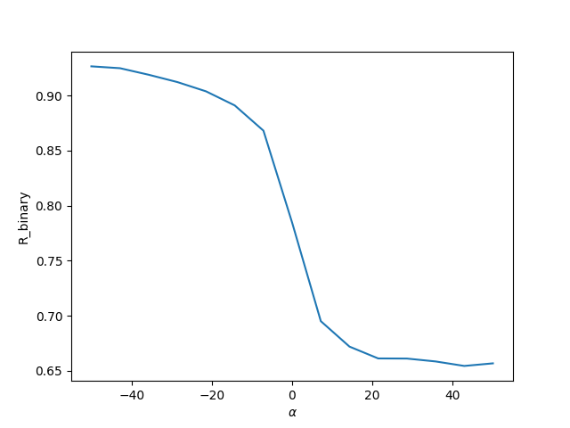 | 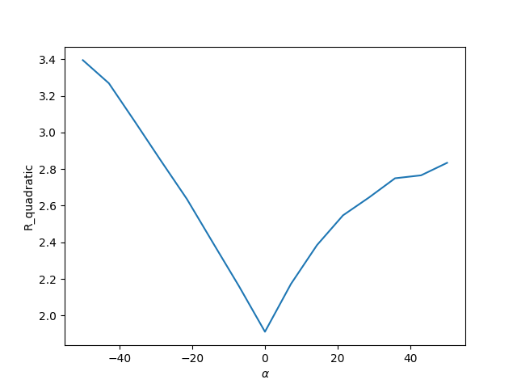  |


## Lab 5 – Efficient computation of a sum of a subarray in 1D, 2D, and 3D.

### Usage
```terminaloutput
$ python subsum.py                                    
```

| Numpy Simple Sum of a Subarray. 1D  |      Fast Sum of a Subarray. 1D      |
|-------------------------------------|:------------------------------------:|
| 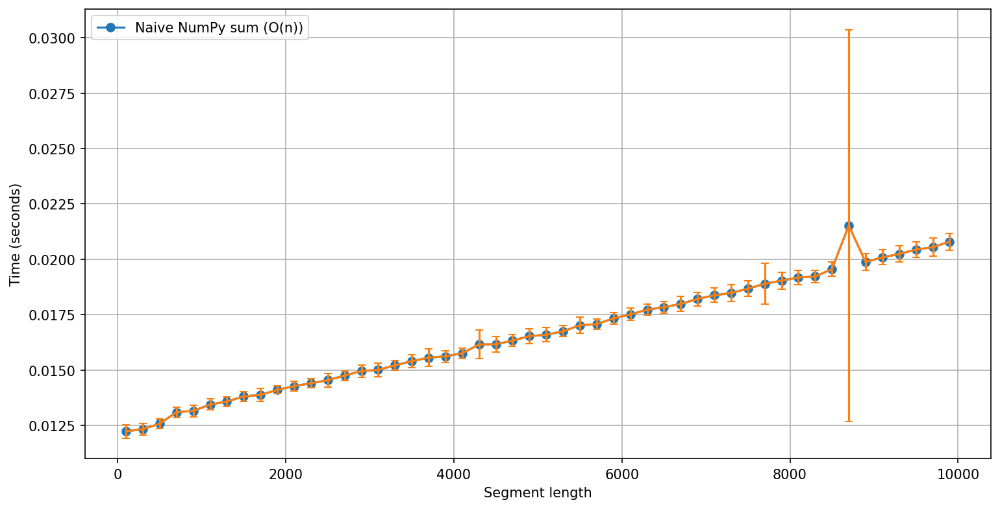 | 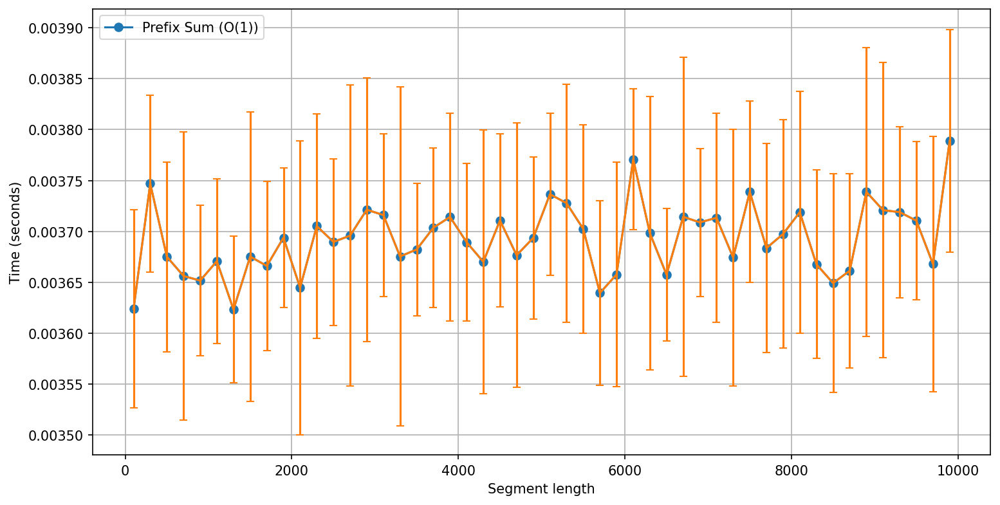 |


## Lab 6 – Divisibility sum of digits 

### Description
The program generates a number image and then apply noise and checks whether it is divisible by a given number.


### Usage
```
$ python3 division_recognition.py --help                                             
usage: division_recognition.py [-h] --n_digits N_DIGITS [--divisor DIVISOR] --noise_level NOISE_LEVEL [--height_digit HEIGHT_DIGIT] [--width_digit WIDTH_DIGIT]
                               [--n_iter N_ITER] [--seed SEED]

Generate a number image.

options:
  -h, --help            show this help message and exit
  --n_digits N_DIGITS   Number of digits to generate.
  --divisor DIVISOR     Check division by.
  --noise_level NOISE_LEVEL
                        Bernoulli noise level. (0 to 1).
  --height_digit HEIGHT_DIGIT
                        Height of the digit image.
  --width_digit WIDTH_DIGIT
                        Width of the digit image.
  --n_iter N_ITER       Test multiple times.
  --seed SEED           Random seed for reproducibility
```

### Example

```
$ python3 division_recognition.py --n_digits 5 --noise_level 0.4 --n_iter 5 --seed 50
100%|████████████████████████████████████████████████████████████████████████████████████████████████████████████████████████████████████| 5/5 [00:00<00:00, 4917.12it/s]
Number:  71241  Divided by 3:  True
Number:  86765  Divided by 3:  False
Number:  69853  Divided by 3:  False
Number:  49472  Divided by 3:  False
Number:  20640  Divided by 3:  True
Success divisions:  2/5
time :  0.018097166999723413 sec
```

| Image                                  |                      Noised Image                       |
|----------------------------------------|:-------------------------------------------------------:|
| 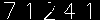 | 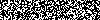  |
| 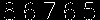 | 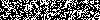 |
| 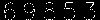 | 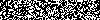 |
| 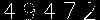 | 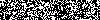 |
| 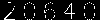 | 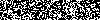  |


## Lab 7 – Binocular stereo vision

### Usage

```
$ python3 stereo.py --help                                                              
usage: stereo.py [-h] --left LEFT --right RIGHT [--alpha ALPHA] [--maxd MAXD]

Stereo DP Algorithm.

options:
  -h, --help     show this help message and exit
  --left LEFT    Path to left image
  --right RIGHT  Path to right image
  --alpha ALPHA  Smoothness weight
  --maxd MAXD    Max disparity
```

### Example

```bash
python3 stereo.py --left examples/im2.ppm --right examples/im5.ppm --alpha 10 --maxd 50
```

| Left Image                        | Right Image             |                      Disparity Map                      |
|-----------------------------------|-------------------------|:-------------------------------------------------------:|
|    |  | 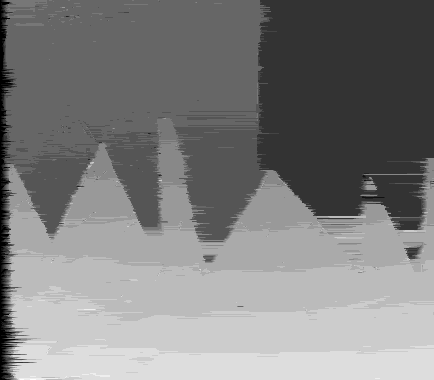  |

Images - http://vision.middlebury.edu/stereo/data/


## Lab 8 – Binary Clustering

### Description

EM algorithm implementation.

### Usage
```terminaloutput
$ python3 em.py --help                                                      
usage: em.py [-h] [--first_cluster_digit FIRST_CLUSTER_DIGIT] [--second_cluster_digit SECOND_CLUSTER_DIGIT] [--n_iter N_ITER]

EM for MNIST Clusters.

options:
  -h, --help            show this help message and exit
  --first_cluster_digit FIRST_CLUSTER_DIGIT
  --second_cluster_digit SECOND_CLUSTER_DIGIT
  --n_iter N_ITER
```

### Example

```terminaloutput
$ python3 em.py --first_cluster_digit 0 --second_cluster_digit 2 --n_iter 50
Fetching MNIST...
Training on 10000 samples...
100%|███████████████████████████████████████████████████████████████████████████████████████████████████████████████████████████████████████████████████████████████| 50/50 [00:00<00:00, 170.35it/s]
Training completed in 0.3000 seconds
Testing on 3893 samples...
Test set accuracy: 0.9604
```

## Kab 9 - Finding the separating circle

### Description
Modification of Perceptron Algorithm where hyperplane is a circle (modified scalar product).

### Usage
```terminaloutput
$ python3 perceptron_circle.py --help
usage: perceptron_circle.py [-h] [--n N] [--seed SEED]

Perceptron Circle Fit.

options:
  -h, --help   show this help message and exit
  --n N        Number of points to generate.
  --seed SEED  Random seed for reproducibility.
```

### Example

```terminaloutput
$ python3 perceptron_circle.py --n 300 --seed 31
Original:  a=0, b=8, r=9
Predicted: a=0.261, b=8.462, r=8.711
```
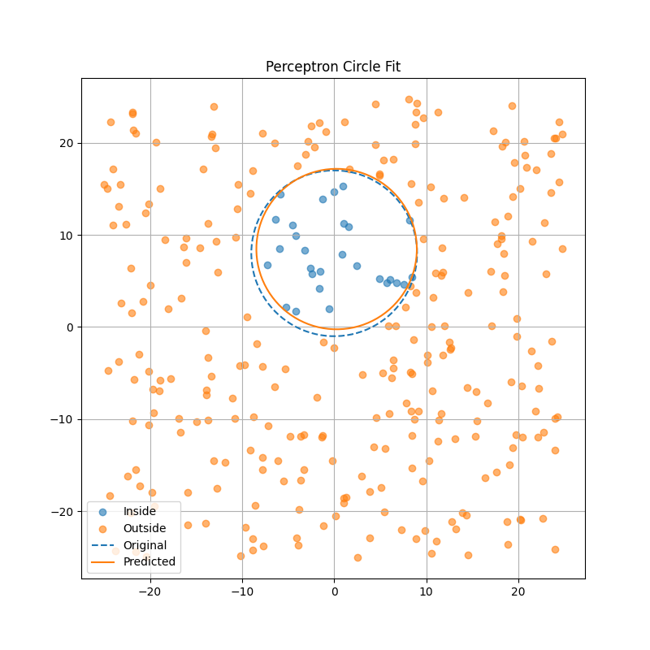